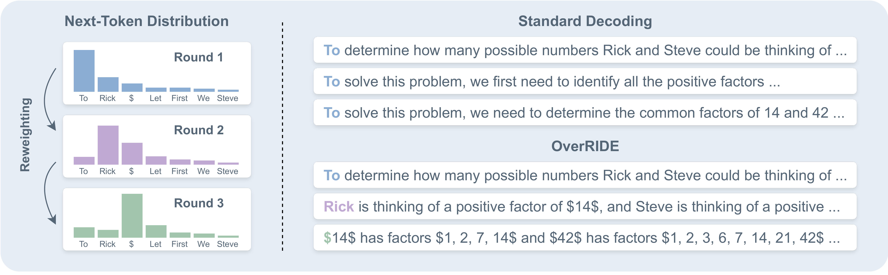

# OverRIDE: Diverse Text Decoding via Iterative Reweighting

The source code for Diverse Text Decoding via Iterative Reweighting (OverRIDE).



## 🔧 Environment

Use the following commands to create a conda environment:

```bash
conda create -n override python=3.10
conda activate override
pip install -r requirements.txt
```

## 💾 Data

Use the following commands to download the data:

```bash
python utils/data_preprocess/humaneval.py
python utils/data_preprocess/math500.py
python utils/data_preprocess/gsm8k.py
python utils/data_preprocess/ccnews.py
```

The corresponding data will be saved in the `data` folder.

## 🚀 Evaluation

Use the following scripts to conduct the corresponding experiments:

```bash
bash scripts/override.sh
bash scripts/rank.sh
bash scripts/throughput.sh
```